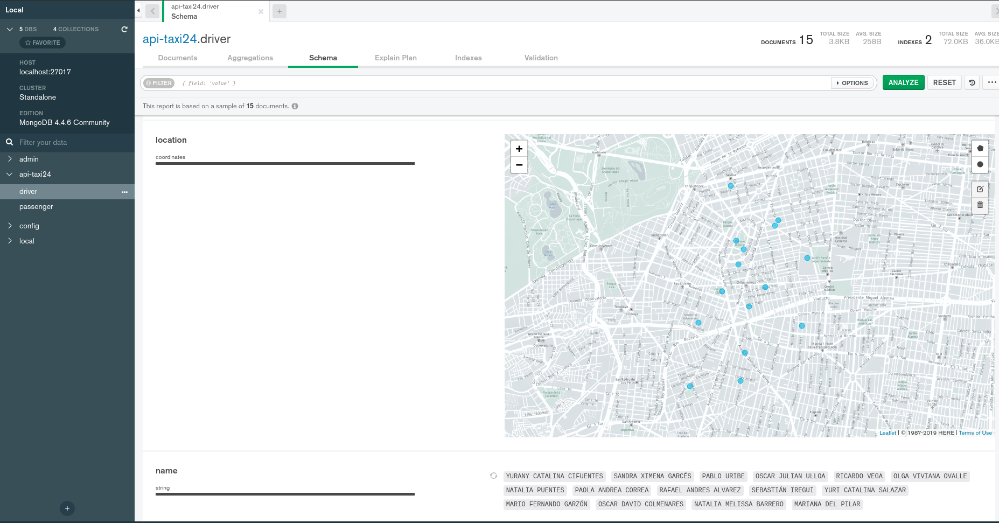

# Examen Taxi 24
> Por: Alvaro Salas
> [Linkedin](https://www.linkedin.com/in/alvarosalasmtz/)
> [GitHub](https://github.com/alvarosalasmtz)

## Tecnologías en el Microservicio taxi24:

- Maven 3.8.1
- Java 8
- Spring Boot 2.5.1
- MongoDB Community 4.4.6

## Features:
> Nota: Por carga de trabajo el proyecto se realizo en pocas horas

- Mejor manejo de Excepciones
- Pruebas unitarias y uso de TDD
- Deploy con Docker
- Analisis de codigo y cobertura Sonar

## Ejecucion:

> Nota: La ejecución se realizo en SO Ubuntu 21.04
1. Se requiere de la Base de Datos: MongoDB
   [Install MongoDB en Ubuntu](https://docs.mongodb.com/manual/tutorial/install-mongodb-on-ubuntu/)
2. Asegurar de tener configurado Java
   Ejemplo:
```sh
echo $JAVA_HOME
/usr/lib/jvm/java-8-openjdk-amd64/
```
3. Ejecutar comandos **maven**
```sh
mvn clean install
mvn spring-boot:run
```
4. Abrir en explorador web la siguiente URL:
   [Doc Swager API Taxi 24](http://localhost:8080/swagger-ui/index.html)
5. Para pruebas se pueden usar las cordenandas:
> latitud: 19.409935             
> longitud: -99.175871

[Buscar condutores dada una locación en un rango de 3km](http://localhost:8080/swagger-ui/index.html#/driver-controller/findAllOnlineAndLocationUsingGET)
```sh
curl -X GET "http://localhost:8080/drivers/online/radio/3/location?latitude=19.409935&longitude=-99.175871" -H "accept: */*"
```

[Buscar conductores más cercanos ordenandos del más cercano al más lejano](http://localhost:8080/swagger-ui/index.html#/driver-controller/findAllOnlineAndLocationNearUsingGET)
```sh
curl -X GET "http://localhost:8080/drivers/online/location-near?latitude=19.409935&longitude=-99.175871" -H "accept: */*"
```


> Nota: se puede usar MongoDB Compass Comunity para analizar las colleciones y ver el mapa geoespacial de ubicaciones de conductores:
> 
# taxi24
